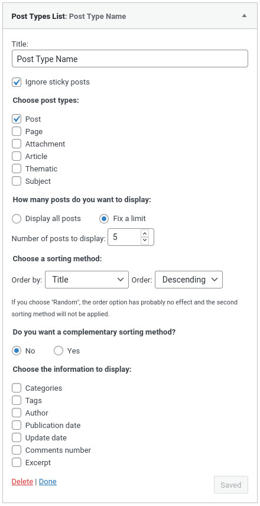
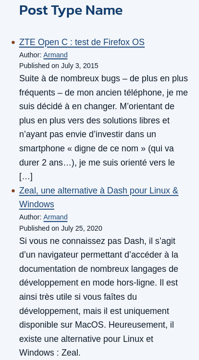

# Post Types List Widget

 

A WordPress Widget to display a list of posts by post types with custom options.

## Presentation

This widget can be place in your sidebar to display a list of posts by post types. It allows you to choose:

-   between the default post types and your custom post types
-   if all posts must be displayed or if you prefer to set a number of posts
-   a sorting method (publication date, title, random...) and a sorting order
-   an additional sorting method (optional)
-   which data to display (dates, excerpt...)

If you have sticky posts, you may want checked "_Ignore sticky post_" to prevent them to appear at the top of the list.

Although the name of the widget is not very explicit, it allows you to build custom queries through `WP_Query` but all arguments are not available. At first, the idea was to list all posts for custom post types a little like the Categories widget. Then, I decide to add more options to make the widget more reusable.

## Installation

### Composer installation

You can use Composer to install this plugin as a dependency if you use custom installers:

```
{
"require": {
    "armandphilippot/post-types-list-widget": "dev-master"
}
"repositories": [{
    "type": "git",
    "url": "git@github.com:ArmandPhilippot/post-types-list-widget.git"
}]
```

### Manual installation

You can download this plugin on Github, then extract it in `/wp-content/plugins/` directory.

## Usage

1. Navigate to the "_Plugins_" dashboard page and click on "_Activate_".
2. Add "_**Post Types**_" to a widget area through the "_Widgets_" menu in WordPress.
3. Configure settings.

## Screenshots

| Admin view                                                 | Public view                                                  |
| ---------------------------------------------------------- | ------------------------------------------------------------ |
|  |  |

## License

This project is open source and available under the [GPL v2 or later License](https://github.com/ArmandPhilippot/post-types-list-widget/blob/master/LICENSE).
